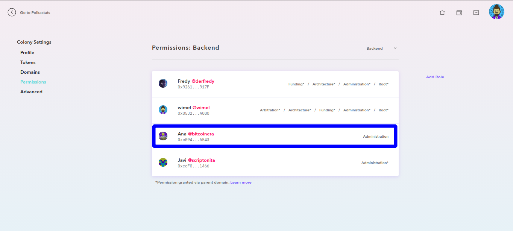

### Cómo añadir permisos a un usuari@ en nuestra colonia

>_Antes de empezar como siempre debemos tener Metamask desbloqueado e iniciar la sesión con nuestra wallet de Ethereum usada anteriormente para la colonia; para este paso necesitaremos algunos ETHs en la wallet para la comisión de la tx._

* Una vez que estamos en el perfil de nuestra colonia hacemos clic en el engranaje que tenemos en la esquina superior izquierda(_a la derecha del nombre de la colonia_)

* En el menú de la izquierda seleccionamos `Permissions`.

* Elegimos el dominio en el que queramos modificar los permisos del usuari@ haciendo clic en el desplegable de la derecha.

* Seleccionamos `Add Role`

* Nos aparece un nuevo menú con varias opciones, hacemos clic en `Select Member` y buscamos al usuari@ que queremos dar permisos:

* Tenemos varias opciones, para nuestro caso seleccionamos `Administration` para que el usuari@ pueda crear y gestionar nuevas tareas y hacemos clic en `Confirm`:

* Nos aparecerá una ventana alertándonos de que tenemos una transaccion pendiente, hacemos clic en `Confirm`:

* De nuevo Metamask nos avisa por última vez por si queremos modificar la comisión de la tx:

* Una vez que la tx haya sido confirmada, el usuari@ tendrá los permisos.

--

--