# Aquí se describen los pasos para reclamar tus DOTs

> Esta guía está basada en la oficial de Polkadot _(puedes encontrarla [aquí](https://claims.polkadot.network/), difuminaremos algunas partes. Si necesitas ayuda en el proceso no dudes en pasarte por la [Colmena](https://www.colmenalabs.org/) o preguntar en el [canal de Telegram de Polkadot en Español](https://t.me/polkadotespanol))_.

### ¿Qué necesitas para reclamar tus DOTs?

- Una wallet de Ethereum con los DOTs y la App de MyCrypto instalada.

> _(Podemos comprobar/descargar la última version de la App de MyCrypto [aquí](https://github.com/MyCryptoHQ/MyCrypto/releases); si usamos Linux es tan sencillo como descargar el archivo `.appimage` de su repositorio, dar permisos `chmod a+x linux-x86-64_1.X.X_MyCrypto.AppImage` y ejecutar la app `./linux-x86-64_1.X.X_MyCrypto.AppImage`)_.

- Una wallet de Polkadot, puedes usar:

    -  El plugin de [`Polkadot.js`](https://chrome.google.com/webstore/detail/polkadot%7Bjs%7D-extension/mopnmbcafieddcagagdcbnhejhlodfdd?hl=en) _(desarrollado para navegadores basados en Chrome, Chromium y Firefox)_.

    - [Subkey](https://github.com/paritytech/substrate/tree/master/bin/utils/subkey).

    - Directamente en el navegador con [Polkadot.js](https://polkadot.js.org/apps/) _(menos seguro)_.

### Pasos para reclamar tus DOTs:

**1.** Comprueba tu wallet de Ethereum [aquí](https://claims.polkadot.network/#verify-ethereum-address).

**2.** Genera una [wallet de Polkadot](https://claims.polkadot.network/#wallet-create).

**3.** [Reclama](https://claims.polkadot.network/#claim-process) tus DOTs usando MyCrypto.

**4.** [Verifica](https://claims.polkadot.network/#claim-verify) que has reclamado correctamente tus DOTs.

### Paso 1, comprobar tu wallet de Ethereum

Diríjase a [esta](https://claims.polkadot.network/#verify-ethereum-address) página e introduce tu wallet de Ethereum para comprobar que tiene DOTs.

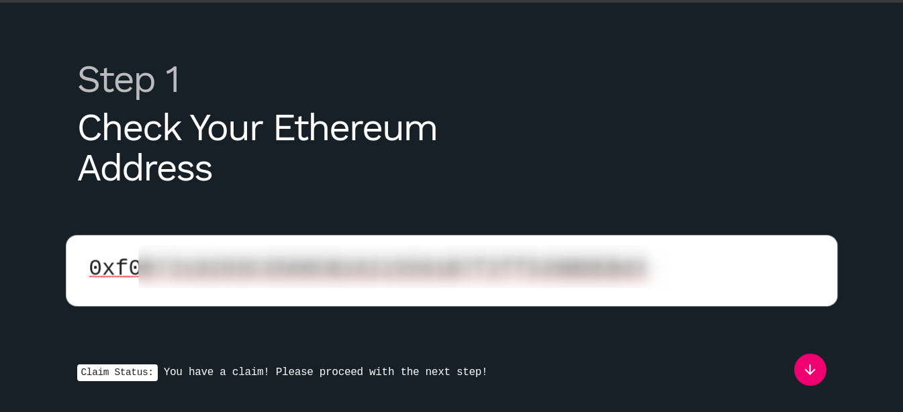

> Podemos apreciar que en `Claim Status`, _(abajo a la izquierda)_ nos aparece un mensaje avisándonos de que esa wallet tiene DOTs y puede reclamarlos.

### Paso 2, generar una wallet para Polkadot

#### Usando el plugin de `polkadot.js`:

Instalamos el plugin en el navegador abriendo [este enlace](https://chrome.google.com/webstore/detail/polkadot%7Bjs%7D-extension/mopnmbcafieddcagagdcbnhejhlodfdd?hl=en), haciendo clic en `Add to Chrome` _(para el ejemplo usaremos Chrome, pero funciona igual en Firefox o Brave)_.

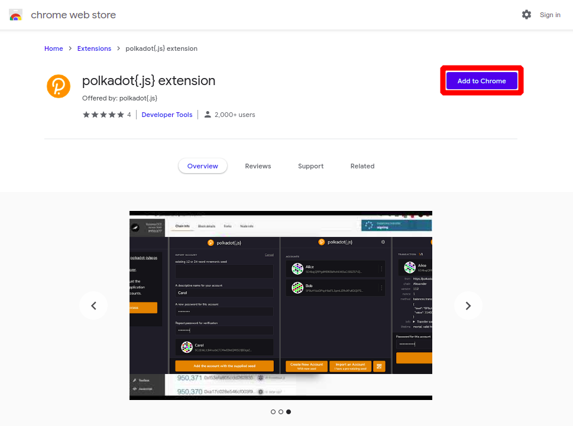

Aceptamos el mensaje de alerta de Chrome avisando de que este complemento puede leer y modificar los datos de nuestro navegador.

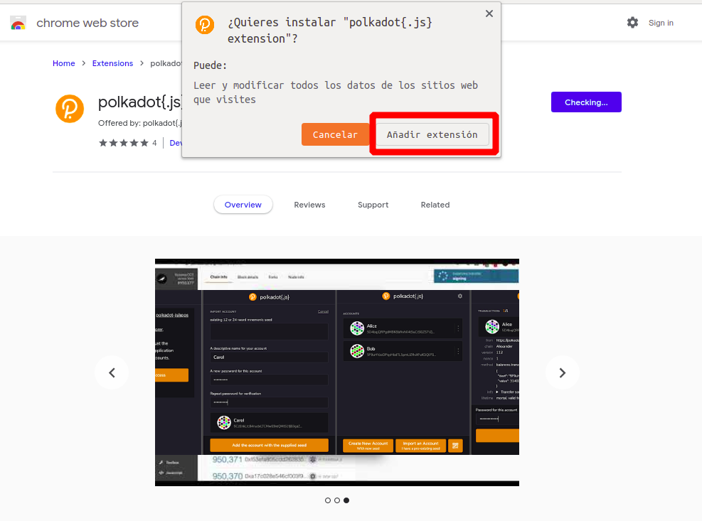

> Comprobamos que se ha instalado correctamente el plugin en nuestro navegador.


Hacemos clic en el plugin _(arriba a la derecha de nuestro navegador)_ y aceptamos el primer mensaje.

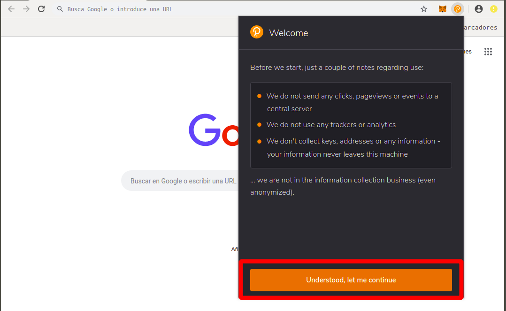

Seleccionamos `Create New Account` para generar una wallet nueva.

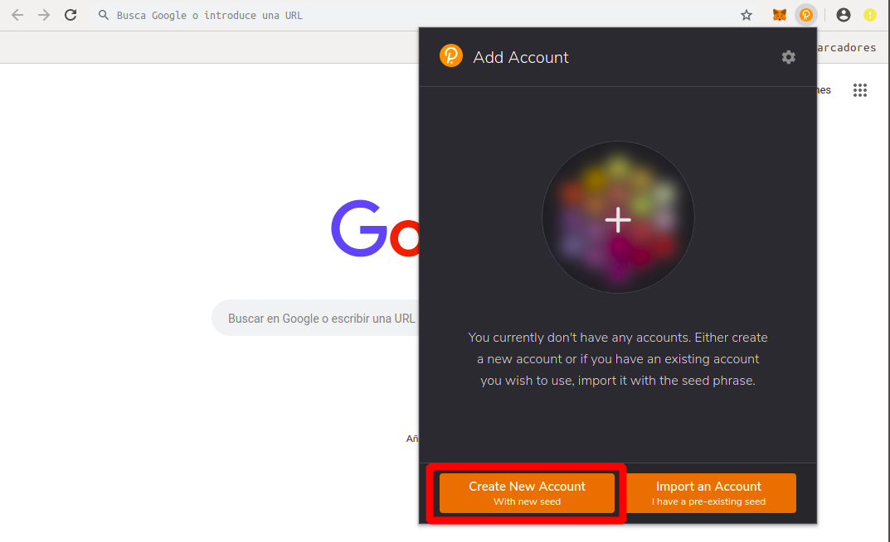

Copiamos **las 12 palabras** _(comprobad que se han copiado bien las palabras pues es la única forma de recuperar nuestra wallet si le pasara algo a nuestro ordenador)_ y marcamos `I have saved my mnemonic seed safely` y hacemos clic en `Next step`.

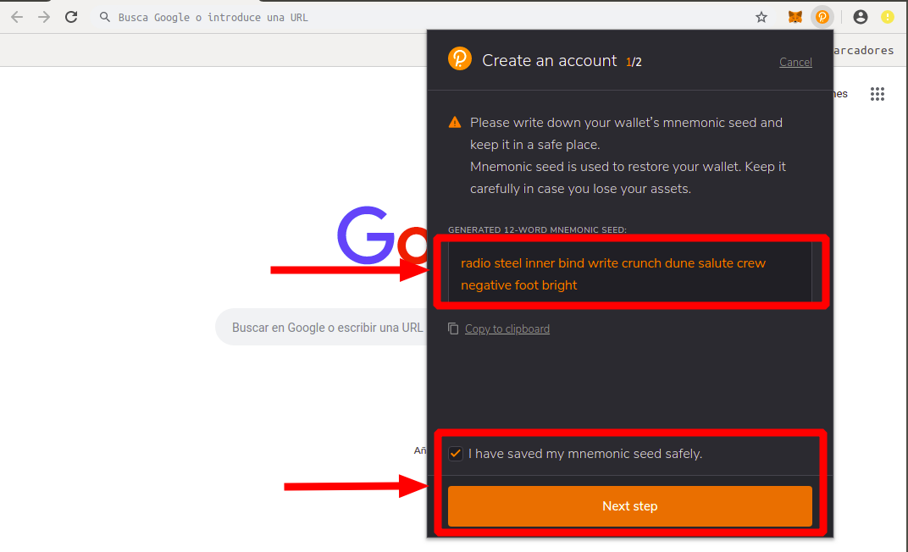

Añadimos un nombre para la wallet, introducimos una contraseña y hacemos clic en `Add the account with the generated seed`.

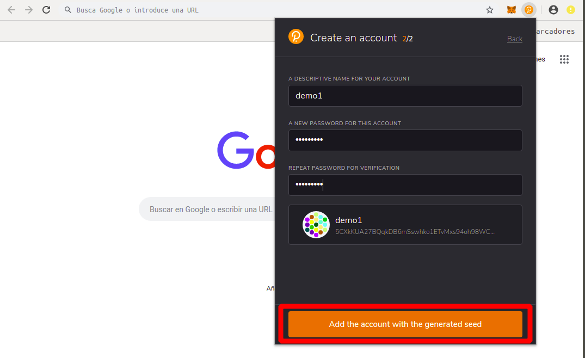

> Comprobamos que hemos generado la wallet correctamente.

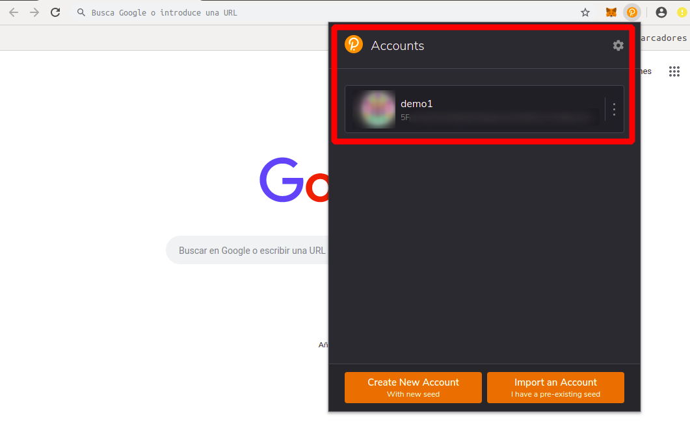

### Paso 3, reclamar los DOTs usando `MyCrypto`

Descargamos la App de MyCrypto _(debemos tener la clave privada, el archivo `Keystore` o el `mnemonic Phrase` para manejarla desde la App de MyCrypto)_, seleccionamos:
 `Contracts` > `Interact` > `Custom`.

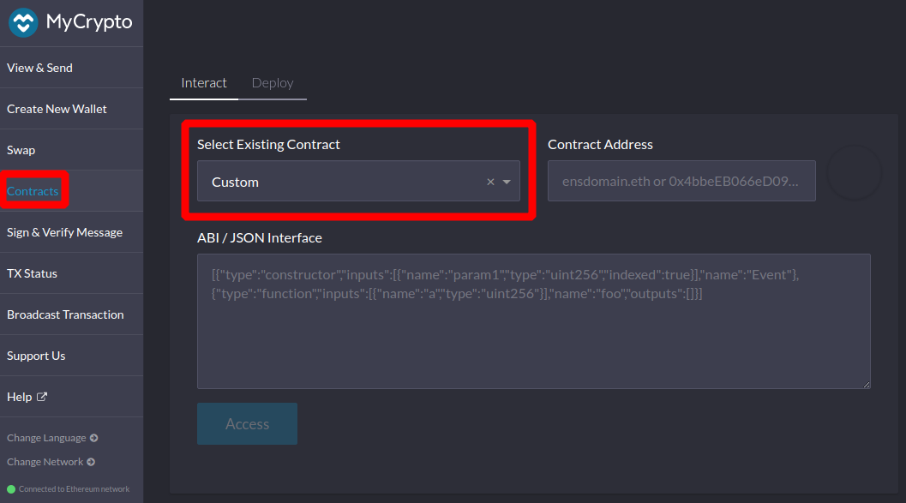

En el espacio `ABI/JSON Interface` pegamos el siguiente código _(puedes comprobarlo [aquí](https://claims.polkadot.network/#wallet-create))_:

```json
[{"inputs":[{"internalType":"address","name":"_owner","type":"address"},{"internalType":"address","name":"_allocations","type":"address"},{"internalType":"uint256","name":"_setUpDelay","type":"uint256"}],"payable":false,"stateMutability":"nonpayable","type":"constructor"},{"anonymous":false,"inputs":[{"indexed":true,"internalType":"address","name":"original","type":"address"},{"indexed":true,"internalType":"address","name":"amendedTo","type":"address"}],"name":"Amended","type":"event","signature":"0x385f6a4b73038a5f14e3482732f99dde086b6fd0930af57604250b72726f4392"},{"anonymous":false,"inputs":[{"indexed":true,"internalType":"address","name":"eth","type":"address"},{"indexed":true,"internalType":"bytes32","name":"dot","type":"bytes32"},{"indexed":true,"internalType":"uint256","name":"idx","type":"uint256"}],"name":"Claimed","type":"event","signature":"0x9b01158d4bc10c112ba32b5240cda97e49e2eb86021f03f6a0f460342ac4dfda"},{"anonymous":false,"inputs":[{"indexed":true,"internalType":"address","name":"eth","type":"address"},{"indexed":true,"internalType":"uint256","name":"idx","type":"uint256"}],"name":"IndexAssigned","type":"event","signature":"0xfe8e0f7f7b06a0461a35a3efd185ab04bf2c1b47d74ced0ad04fc5dda048d4aa"},{"anonymous":false,"inputs":[{"indexed":true,"internalType":"bytes32","name":"pubkey","type":"bytes32"},{"indexed":false,"internalType":"uint256","name":"newTotal","type":"uint256"}],"name":"InjectedSaleAmount","type":"event","signature":"0x572e24c41e0a8fb122e74d5ae46960a12d21bc621ae05d27b56958e46dab916c"},{"anonymous":false,"inputs":[{"indexed":true,"internalType":"address","name":"old","type":"address"},{"indexed":true,"internalType":"address","name":"current","type":"address"}],"name":"NewOwner","type":"event","signature":"0x70aea8d848e8a90fb7661b227dc522eb6395c3dac71b63cb59edd5c9899b2364"},{"anonymous":false,"inputs":[{"indexed":true,"internalType":"address","name":"eth","type":"address"},{"indexed":false,"internalType":"uint256","name":"amount","type":"uint256"}],"name":"Vested","type":"event","signature":"0x00d5958799b183a7b738d3ad5e711305293dd5076a37a4e3b7e6611dea6114f3"},{"anonymous":false,"inputs":[{"indexed":true,"internalType":"address","name":"eth","type":"address"},{"indexed":false,"internalType":"uint256","name":"newTotal","type":"uint256"}],"name":"VestedIncreased","type":"event","signature":"0xddd46b2454e8e8195e43bab9d77da6c175cf57feab9936752d696f980bd22f5c"},{"constant":true,"inputs":[],"name":"UINT_MAX","outputs":[{"internalType":"uint256","name":"","type":"uint256"}],"payable":false,"stateMutability":"view","type":"function","signature":"0x782d2b53"},{"constant":true,"inputs":[],"name":"allocationIndicator","outputs":[{"internalType":"contract FrozenToken","name":"","type":"address"}],"payable":false,"stateMutability":"view","type":"function","signature":"0x1db2bbe8"},{"constant":true,"inputs":[{"internalType":"address","name":"","type":"address"}],"name":"amended","outputs":[{"internalType":"address","name":"","type":"address"}],"payable":false,"stateMutability":"view","type":"function","signature":"0xedd83104"},{"constant":true,"inputs":[{"internalType":"uint256","name":"","type":"uint256"}],"name":"claimed","outputs":[{"internalType":"address","name":"","type":"address"}],"payable":false,"stateMutability":"view","type":"function","signature":"0xdbe7e3bd"},{"constant":true,"inputs":[{"internalType":"address","name":"","type":"address"}],"name":"claims","outputs":[{"internalType":"uint256","name":"index","type":"uint256"},{"internalType":"bytes32","name":"pubKey","type":"bytes32"},{"internalType":"bool","name":"hasIndex","type":"bool"},{"internalType":"uint256","name":"vested","type":"uint256"}],"payable":false,"stateMutability":"view","type":"function","signature":"0xc6788bdd"},{"constant":true,"inputs":[{"internalType":"bytes32","name":"","type":"bytes32"},{"internalType":"uint256","name":"","type":"uint256"}],"name":"claimsForPubkey","outputs":[{"internalType":"address","name":"","type":"address"}],"payable":false,"stateMutability":"view","type":"function","signature":"0x11fb3de1"},{"constant":true,"inputs":[],"name":"endSetUpDelay","outputs":[{"internalType":"uint256","name":"","type":"uint256"}],"payable":false,"stateMutability":"view","type":"function","signature":"0xd2c41b57"},{"constant":true,"inputs":[],"name":"nextIndex","outputs":[{"internalType":"uint256","name":"","type":"uint256"}],"payable":false,"stateMutability":"view","type":"function","signature":"0xfc7e9c6f"},{"constant":true,"inputs":[],"name":"owner","outputs":[{"internalType":"address","name":"","type":"address"}],"payable":false,"stateMutability":"view","type":"function","signature":"0x8da5cb5b"},{"constant":true,"inputs":[{"internalType":"bytes32","name":"","type":"bytes32"}],"name":"saleAmounts","outputs":[{"internalType":"uint256","name":"","type":"uint256"}],"payable":false,"stateMutability":"view","type":"function","signature":"0x42ac39a8"},{"constant":false,"inputs":[{"internalType":"address","name":"_new","type":"address"}],"name":"setOwner","outputs":[],"payable":false,"stateMutability":"nonpayable","type":"function","signature":"0x13af4035"},{"constant":false,"inputs":[{"internalType":"address[]","name":"_origs","type":"address[]"},{"internalType":"address[]","name":"_amends","type":"address[]"}],"name":"amend","outputs":[],"payable":false,"stateMutability":"nonpayable","type":"function","signature":"0x63aa56b1"},{"constant":false,"inputs":[{"internalType":"address[]","name":"_eths","type":"address[]"},{"internalType":"uint256[]","name":"_vestingAmts","type":"uint256[]"}],"name":"setVesting","outputs":[],"payable":false,"stateMutability":"nonpayable","type":"function","signature":"0xc3496529"},{"constant":false,"inputs":[{"internalType":"address[]","name":"_eths","type":"address[]"},{"internalType":"uint256[]","name":"_vestingAmts","type":"uint256[]"}],"name":"increaseVesting","outputs":[],"payable":false,"stateMutability":"nonpayable","type":"function","signature":"0x9fd0214c"},{"constant":false,"inputs":[{"internalType":"bytes32[]","name":"_pubkeys","type":"bytes32[]"},{"internalType":"uint256[]","name":"_amounts","type":"uint256[]"}],"name":"injectSaleAmount","outputs":[],"payable":false,"stateMutability":"nonpayable","type":"function","signature":"0x49c3d477"},{"constant":true,"inputs":[{"internalType":"bytes32","name":"_who","type":"bytes32"}],"name":"balanceOfPubkey","outputs":[{"internalType":"uint256","name":"","type":"uint256"}],"payable":false,"stateMutability":"view","type":"function","signature":"0x9ca53c51"},{"constant":false,"inputs":[],"name":"freeze","outputs":[],"payable":false,"stateMutability":"nonpayable","type":"function","signature":"0x62a5af3b"},{"constant":false,"inputs":[{"internalType":"address[]","name":"_eths","type":"address[]"}],"name":"assignIndices","outputs":[],"payable":false,"stateMutability":"nonpayable","type":"function","signature":"0xc37b85a6"},{"constant":false,"inputs":[{"internalType":"address","name":"_eth","type":"address"},{"internalType":"bytes32","name":"_pubKey","type":"bytes32"}],"name":"claim","outputs":[],"payable":false,"stateMutability":"nonpayable","type":"function","signature":"0xc8622c24"},{"constant":true,"inputs":[],"name":"claimedLength","outputs":[{"internalType":"uint256","name":"","type":"uint256"}],"payable":false,"stateMutability":"view","type":"function","signature":"0x93e40f7e"},{"constant":true,"inputs":[{"internalType":"address","name":"_eth","type":"address"}],"name":"hasClaimed","outputs":[{"internalType":"bool","name":"","type":"bool"}],"payable":false,"stateMutability":"view","type":"function","signature":"0x73b2e80e"},{"constant":true,"inputs":[{"internalType":"address","name":"_eth","type":"address"}],"name":"hasAllocation","outputs":[{"internalType":"bool","name":"","type":"bool"}],"payable":false,"stateMutability":"view","type":"function","signature":"0x9af9cc27"}]
```

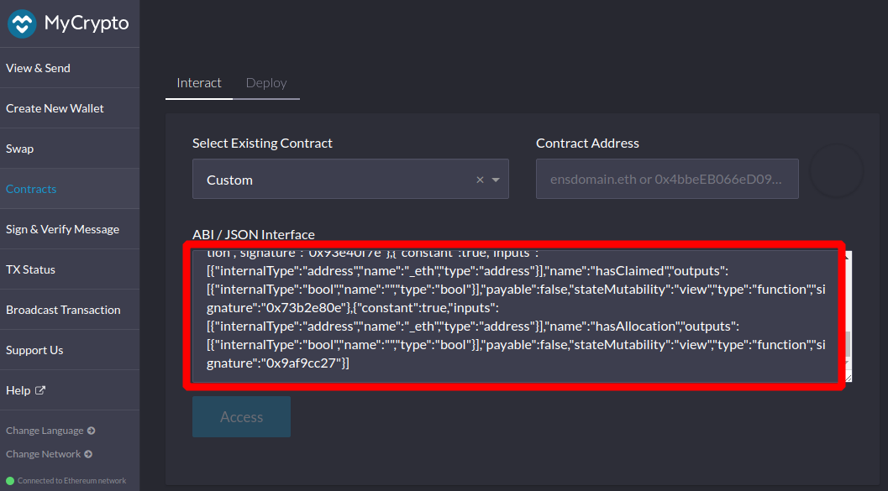

En `Contract Address` añadimos la siguiente wallet del contrato _(puedes comprobarlo [aquí](https://claims.polkadot.network/#wallet-create))_ y hacemos clic en `Access`:

```
0xa2CBa0190290aF37b7e154AEdB06d16100Ff5907
```

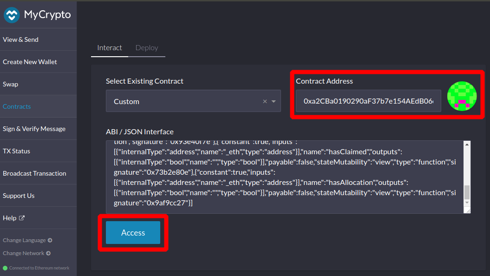

En el desplegable seleccionamos  `claim` _(`claim` **NO** `claims`)_.

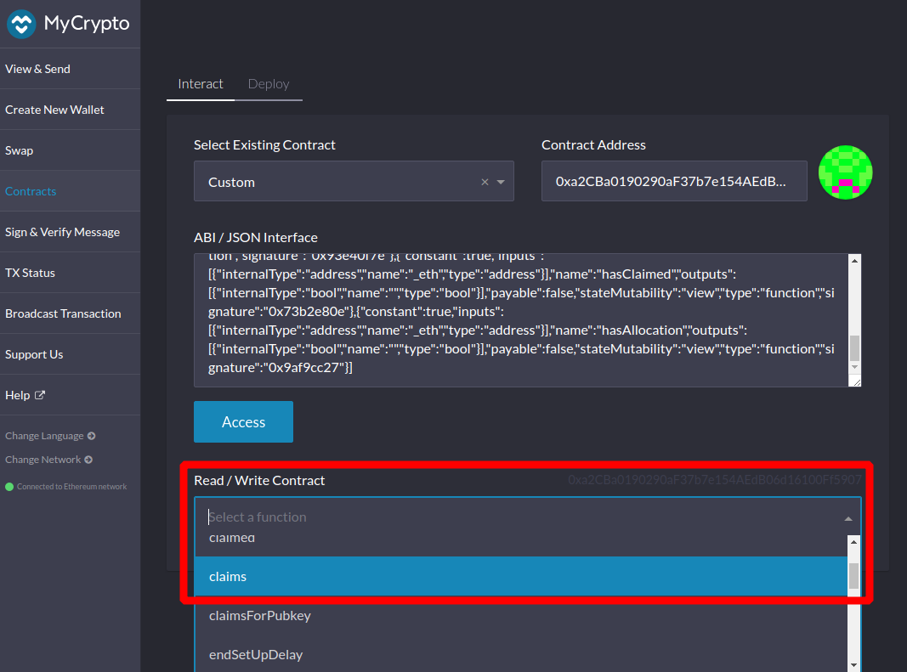

En `_eth address` introducimos la wallet de Ethereum que tiene los DOTs alojados.

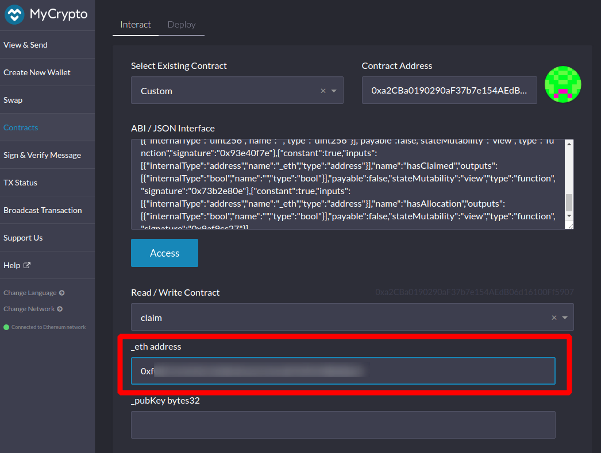

Para obtener la clave pública de nuestra wallet generada anteriormente de Polkadot, nos dirijimos a [este](https://claims.polkadot.network/#wallet-create) enlace e introducimos la wallet de Polkadot.

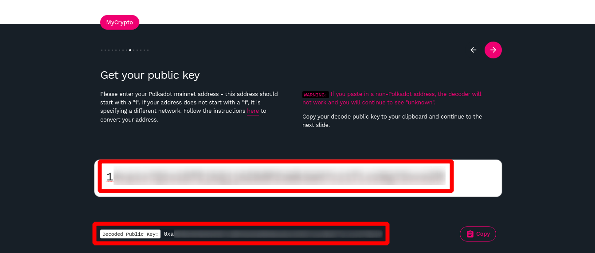

> Si nuestra wallet no empieza por `1` debemos modificarla para que funcione en mainnet, para ello hacemos clic en el plugin, pulsamos en el engranaje que sale en la parte superior iquierda y en el desplegable `DISPLAY ADDRESS FORMAT FOR:` seleccionamos `Polkadot (live)`

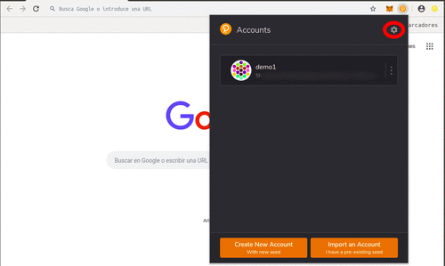

Una vez que sabemos nuestra `pubKey` la introducimos en `_pubKey bytes32`:

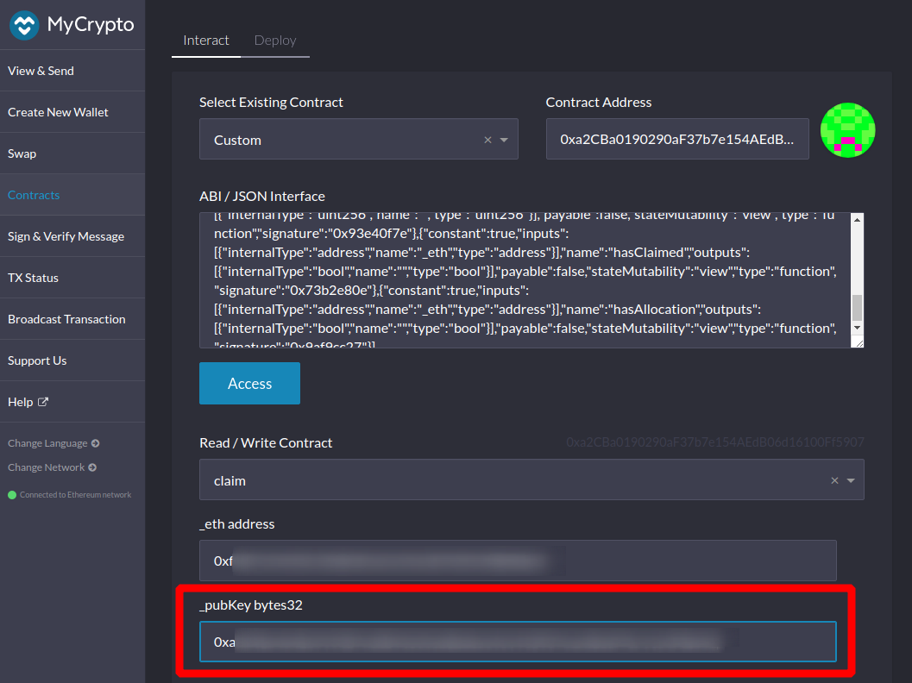

Seleccionamos la forma de usar nuestra wallet de Ethereum para firmar la transacción _(`Private Key`, `Keystore File` o `Mnemonic Phrase`)_ y desbloqueamos nuestra wallet haciendo clic en `Unlock`.

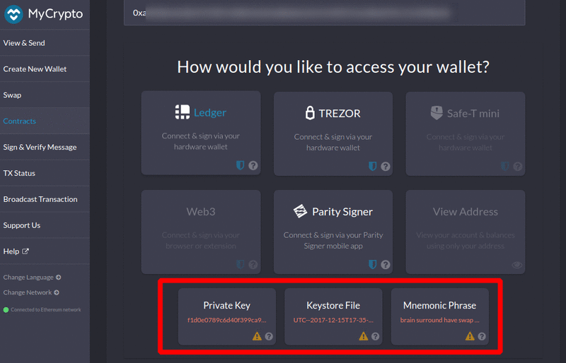

Desmarca la opción `Automatically Calculate Gas Limit` e introduce `200000`

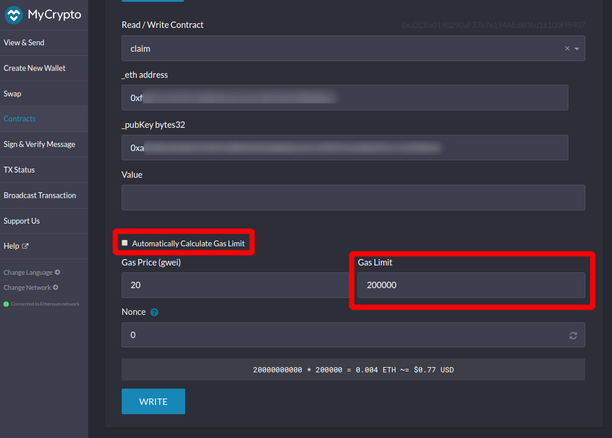

Haz clic en `WRITE` > `Sign Transaction` > `Send Transaction`, y confirma la transacción haciendo clic en `Send`

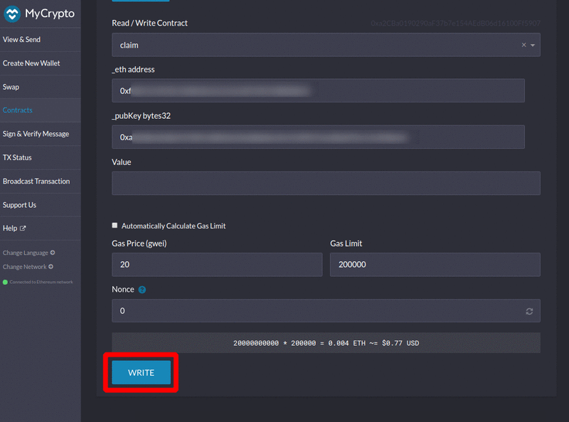

> _(debemos esperar que la transacción haya sido incluida en el bloque para el siguiente paso)_

### Paso 4, comprobamos que nuestra wallet de Polkadot tiene los DOTs

Abrimos la [web](https://claims.polkadot.network/#wallet-create) para comprobar si nuestra wallet de Polkadot tiene los fondos, e introducimos la wallet de Polkadot generada anteriormente.

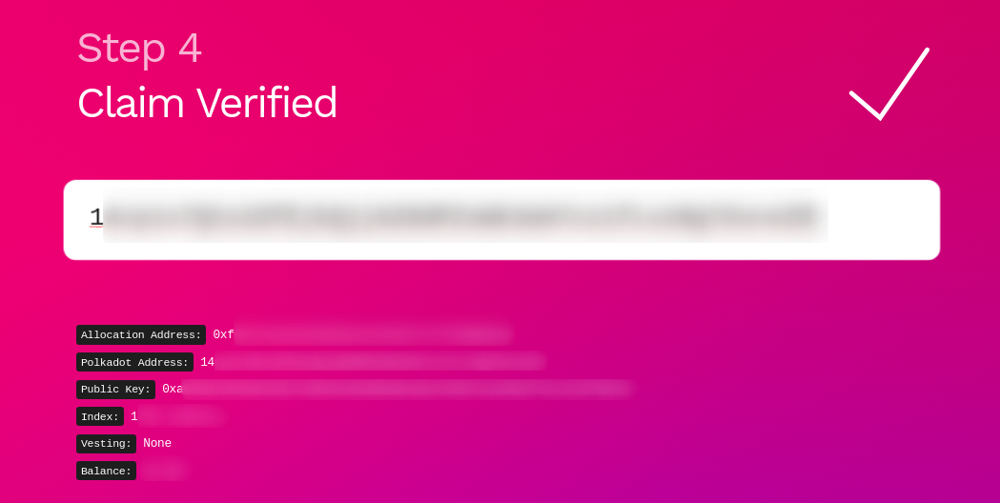

---

> Si al introducir la wallet en la web no nos muestra ningún balance puede ser porque:

>  - La transacción no haya sido incluida en un bloque aún _(en este caso debemos esperar más tiempo hasta que la transacción sea incluida en un bloque)_.

>  - Debamos recargar la web de Polkadot para que actualice los valores.