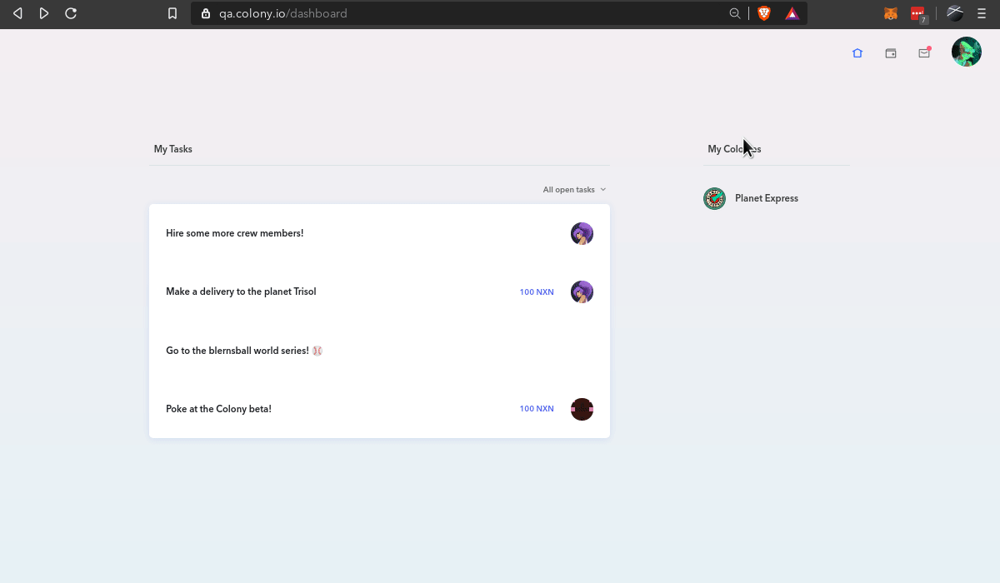

### Cómo crear una colonia

> Una vez [creada la cuenta de Colony](https://help.colony.io/hc/en-us/articles/360024589133-How-to-create-a-colony-account), crear una nueva colonia es fácil.

Haga clic en la imagen de tu perfil y seleccione "Create A Colony".

Introduzca el nombre de tu colonia y elija la URL.

Escoja su token nativo.
(¿Necesita ayuda para elegir su token nativo? Mire [este artículo](https://help.colony.io/hc/en-us/articles/360024589073-How-to-choose-a-native-token))

Confirme todos los detalles.

Despliegue su colonia en la blockchain! (Necesitará ETH para pagar por estas transacciones)

🎉 ¡Genial! 🎉 ¡Acaba de crear su primera colonia!

A continuación, querrá [financiar su colonia](https://help.colony.io/hc/en-us/articles/360024589013-How-to-fund-your-colony).

