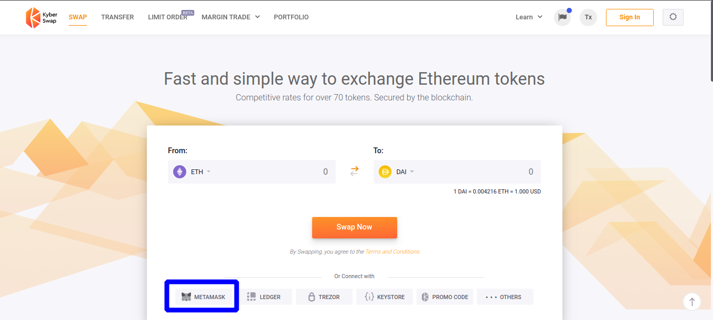

### Cómo usar Kyber para intercambiar tokens ERC20:

* Accedemos a [https://kyberswap.com/swap/](https://kyberswap.com/swap/) y conectamos nuestra cuenta de Metamask.

* A la izquierda en `From` tenemos los tokens que la wallet tiene en propiedad, y a la derecha en `To` los que queremos obtener. Modificamos ambos por los que tengamos o deseemos obtener:

* Una vez tengamos seleccionado el cambio que queremos realizar, hacemos clic en `Swap Now`:

* La interface de Kyber nos muestra los valores de la operación que vamos a realizar, hacemos clic en `Confirm`  pues Metamask nos lo volverá a preguntar una última vez:

* Metamask nos pregunta por última vez, modificamos los valores en caso de necesitar aumentar o reducir la comisión y hacemos clic en `Confirmar`:

_Una vez que la transacción sea confirmada en la red de Ethereum podemos comprobar en un explorador de bloques que efectivamente se ha realizado el cambio (en nuestro caso para el ejemplo) de ETH a DAI_

