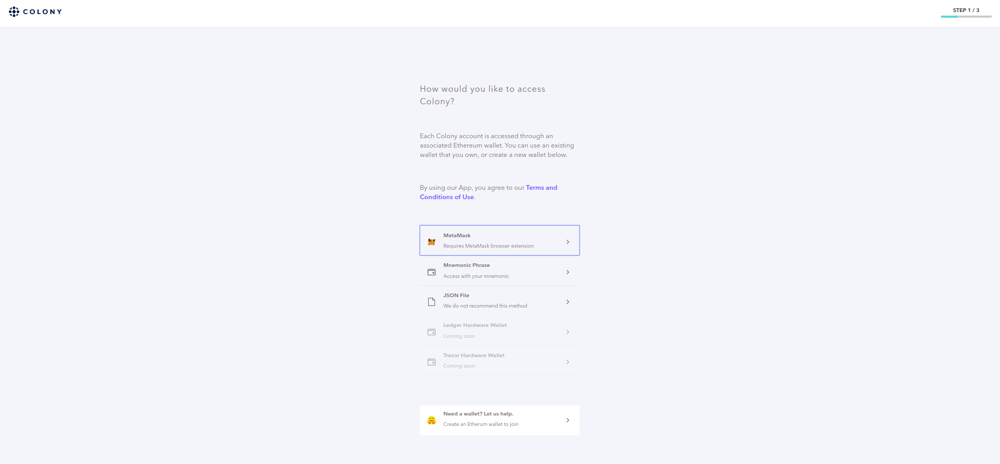
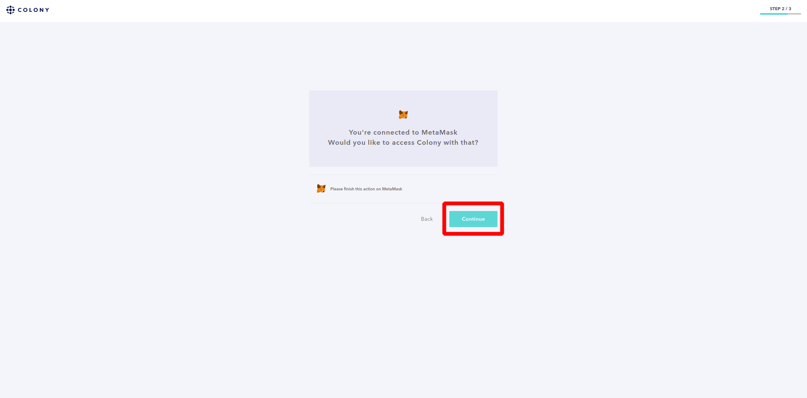
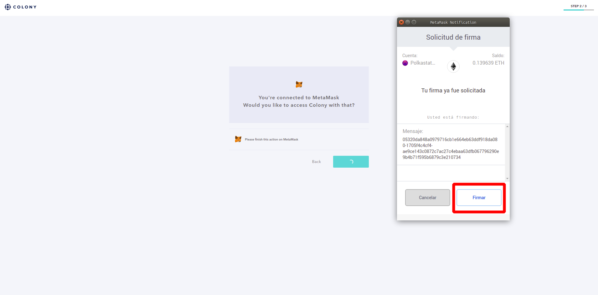
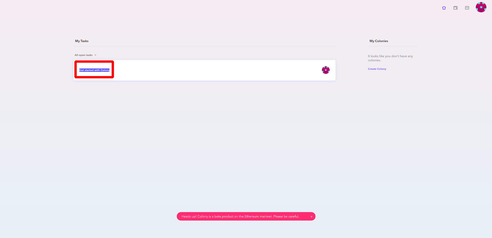
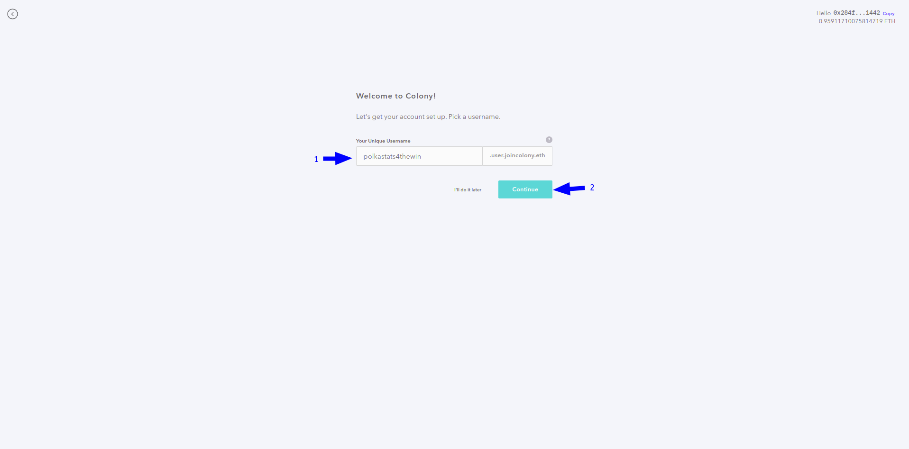
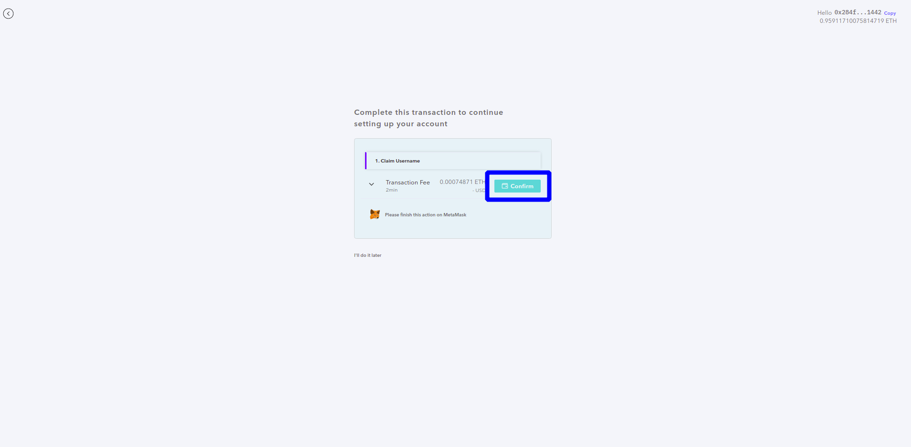
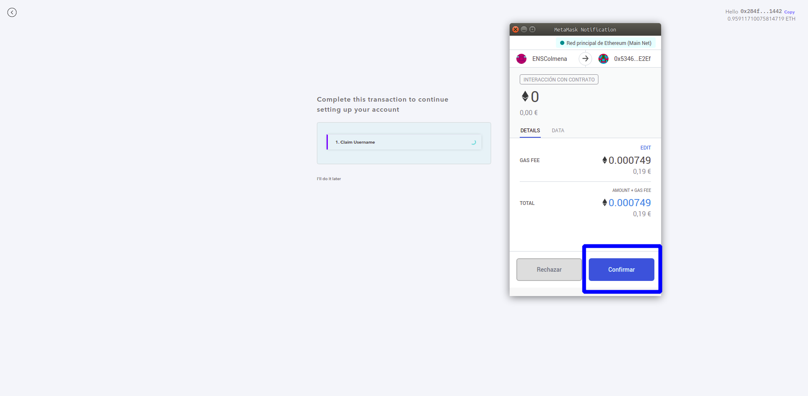
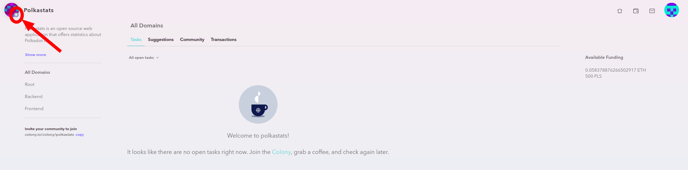
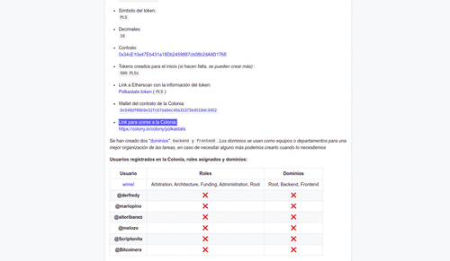

### Cómo unirse a una Colonia _(necesitamos algunos fondos, esta guía está realizada para la Colonia de [Polkastats](https://polkastats.io/))_:

1. Desbloqueamos [Metamask](https://metamask.io/).

2. Abrimos el siguiente enlace [https://colony.io/dashboard](https://colony.io/dashboard)

3. Damos permisos en una ventana emergente para que Colony pueda interactuar con nuestra wallet de Metamask, hacemos clic en `Continue`.

4. Metamask nos avisa con una ventana emergente que estamos firmando un mensaje _(esto no tiene coste alguno)_, hacemos clic en `Firmar`.

5. Una vez en la dApp hacemos clic en `Get started with Colony`.

6. Elegimos el nombre que usaremos, lo escribimos en el recuadro de la izquierda `1→` y hacemos clic en `Continue` `←2`.

7. El siguiente paso haremos clic en `Confirm` pues nos lo preguntará una vez mas Metamask.

8. Una vez que hemos aceptado Metamask nos pregunta por ultima vez por la transacción, podemos editar la comisión que vamos a pagar o dejarla como está, para el caso la dejamos tal cual y hacemos clic en `Confirmar`
_toca esperar que la transacción se confirme, podemos comprobarlo metiendo nuestra wallet en un explorador de bloques como [Etherescan](https://etherscan.io/)_.

9. Abrimos el link de nuestra colonia con Metamask desbloqueado.

10. Una vez que estamos dentro de nuestra colonia en la parte superior izquierda tenemos el nombre de la colonia y su _identicon_, hacemos clic en la estrella del _identicon_ (si dejamos el  ratón encima nos aparece `Join the Colony`)

Ya estamos dentro de la colonia, welcome to hell!! :fire: 