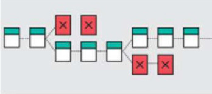

# Bitcoin

La primera __blockchain__, creada por ___Satoshi Nakamoto___, fue hecha con un objetivo concreto, específico y único, crear una alternativa digital al __Sistema Financiero__. Es bastante probable que su fundador y sus precursores no tuviese ni idea, de la nueva rama del conocimiento que estaban creando.

Aunque desde el principio se crearon múltiples alternativas, no fue hasta la llegada de __Ethereum__, que el mundo "entendió" que la blockchain podía utilizarse para mucho más.

Su objetivo principal era: crear dinero "efectivo" digital. Que pudiese ser producido, progresivamente, por los mantenedores de la red _(mineros)_. Y poseído por los propios usuarios directamente, en lugar de mediante bancos o intermediarios.

Para ello uso varias soluciones ya existentes, en algunos casos, creadas con el mismo objetivo en intentos fallidos anteriores, y alguna nueva "herramienta". Las principales son:

- __El cliente o nodo__: La implementación de un cliente para leer y participar en el proceso de mantener la red. Con el tiempo ha acabado, en lo que se conoce como: [Bitcoin Core](https://bitcoin.org/en/download)

- __Bitcoin Script__: Un lenguaje de programación completamente tipado, determinístico y redundante. Pensado para asegurar la correcta transmisión de activos: sin perdidas ni posibilidades de doble gasto. Además de no ser _Turing Complete_ para impedir la creación de bucles que saturaran la red.

<=__Por Colocar__

- Y el más importante, es lo que conocemos como __blockchain__.

Es bastante fácil críticar a la blockchain en general y a __Bitcoin__ en particular. Por ser demasiado lento, limitado, difícil de actualizar, etcétera. Pero esa es, precisamente, la intención de la blockchain a la hora de representar, más que un programa, __un protocolo sobre el que construir__. Y es este probablemente, uno de los puntos fuertes de __Bitcoin__.

La implementación de [Bitcoin Core](https://bitcoin.org/en/download), muy criticada por tener solo a unos 15 desarrolladores detrás, se ha limitado (casi en exclusiva) a la retirada de partes innecesarias. Para realizar su cometido con menos probabilidad de errores.

El lenguaje de Bitcoin Script, se ha ido _"podando"_ con los años y es increíblemente complejo construir cosas con él. Precisamente porque se diseñó para ser lo más robusto y seguro posible. Y su blockchain no ha cambiado las reglas, ni siquiera, para aumentar el número de transacciones. Y sigue teniendo la misma capacidad por bloque que tenía cuando Satoshi la diseño.

El funcionamiento consiste en una competición basada en la _Prueba de Trabajo_ para ganar el premio en la creación de bloques. Estos, están formados por nuevas transacciones válidas,  y el encadenamiento mediante __Hashes__ y __Árboles de Merkle__ entre sí, de manera sucesiva, para facilitar la comprobación de la inmutabilidad.

En esta competición se va liberando progresivamente las unidades de medida llamadas __bitcoin__ _(con minúsculas)_ por el ___Coinbase___. De una manera qué a demostrado ser completamente segura y fiable.

Está prueba de trabajo, es probablemente el punto de mayor crítica. Incluso entre los expertos de blockchain. Sin embargo, es defendida a capa y espada por ser considerada, de momento, la única manera __completamente segura, descentralizada y, sobre todo, sin permisonado__, para permitir la entrada en esta competición de cualquier participante.

_______________________________
### Para ampliar conocimiento

- [Libro de Bitcoin por Andreas Antonopoulus](https://github.com/bitcoinbook)
- [Explorador de estado de las Blockchain](https://coin.dance/blocks)
- [Explorador de direcciones de las Blockchain](https://bitinfocharts.com/top-100-richest-bitcoin-addresses.html)
