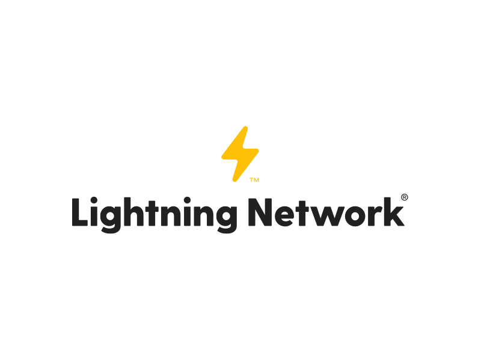

# MeetUp_Lightning_Network

En este MeetUp orientado a __PoS__, vamos a hablar de como afecta a __Bitcoin__.

- En primer lugar explicaremos su blockchain de manera visual y rápida, para asegurarnos que todos entendemos como funciona.

- A continuación, enseñaremos la única pieza _"añadida"_ a Bitcoin: __SegWit__, que convierte a Bitcoin en una __blockchain para sidechains__. _similar a esa blockchain en la que quedará Ethereum con los Shards, que explicó Diego en el MeetUp de Ethereum 2.0 (lógicamente salvando las enormes distancias que hay en el planteamiento de dichas blockchains)_.

- Para terminar veremos la primera sidechain creada sobre SegWit llamada __Lightning Network__, que añade a BTC un sistema de _stake_ bastante diferente del que se plantea en otras blockchain. Para usarla y bastará con una App para móviles como __Eclair__. Con ella, ya podremos crear los canales y todo lo que hace falta para usar LN. Así que acabaremos esta parte con una pequeña práctica para probarlo entre nosotros, y pasarnos unos cuantos ___satoshis___.

### Con esto, esperamos:
##### 1. Ver la _rama_ que representa __Bitcoin__ en el mundo de la blockchain,
##### 2. Veremos el funcionamiento del __PoS__ en el concepto de BTC,
##### 3. Aprender. Por lo que si se encuentra algún error, se agradece la colaboración para resolverlo.
