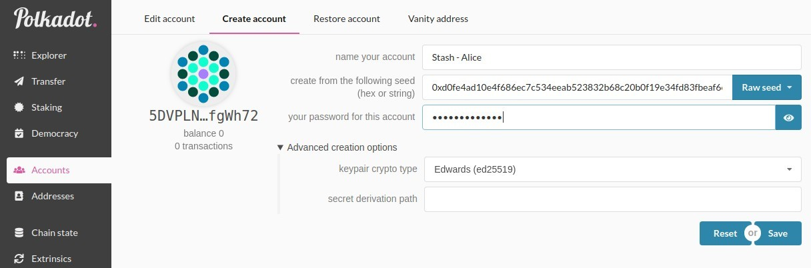
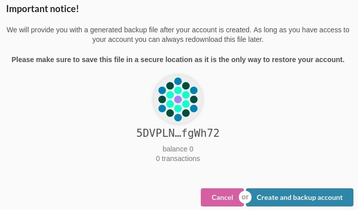
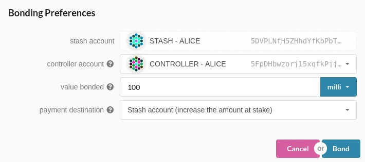
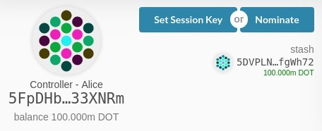
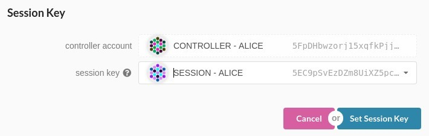
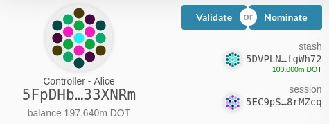
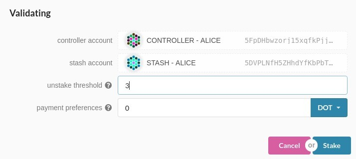
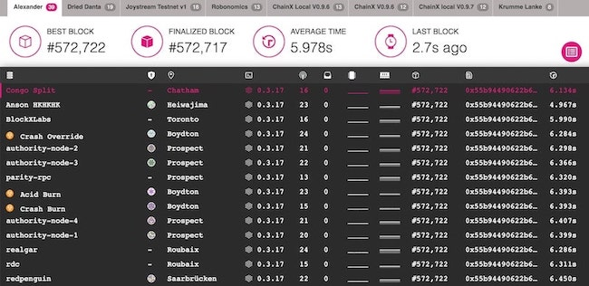
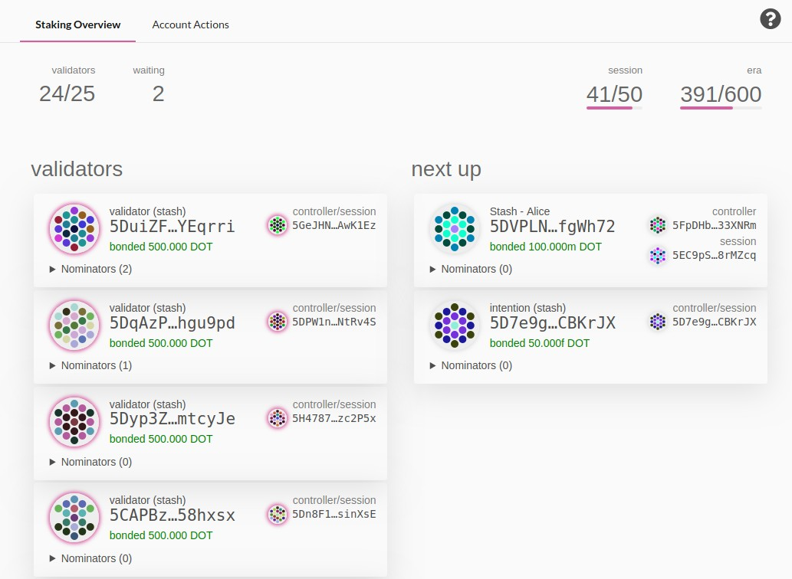

# Polkadot

- [Repositorio oficial](https://github.com/paritytech/polkadot)

<p align="center"> 

</p>

<h1 align="center">Software y documentación relativa al proyecto Polkadot.</h1>

<p align="center">Toda la documentación aquí traducida puedes encontrarla en la <a href="https://github.com/w3f/polkadot-wiki">wiki oficial de Polkadot</a> o en su <a href="https://wiki.polkadot.network/en/latest/">página web</a>.</p>

[Aqui](https://github.com/Colm3na/Polkadot/tree/master/firewall) puedes encontrar el firewall.

---

## Como ser validador

---

**_La [guía original](https://github.com/w3f/polkadot-wiki/blob/master/docs/polkadot/node/guides/how-to-validate.md) ha sido realizada por [Thibaut](https://github.com/Tbaut)._**

**_Muchas gracias por realizar la guía!!_** 

>**Información:** _Este tutorial funciona con la testnet actual de Alexander y ha sido actualizada para PoC-4._

Para ser un buen validador debería:

- Tener DOTs para hacer el _stake_ (**Requisito básico**)
- Mantenga su nodo actualizado con la última versión
- Tener suficiente conocimiento de la seguridad de la red para crear una red robusta
- Utilice HSM (Hardware Security Module) para proteger su clave (**Altamente Recomendado**)

Usted **NO** debe ejecutar un validador si tiene DOTs, pero no tiene suficiente conocimiento técnico para configurar un validador. Se recomienda delegar/nominar sus DOTs a alguien en quien confíe para que le ayude a realizar este tipo de trabajo.

Como nominador, todavía puede obtener las recompensas nominando a múltiples validadores. Si desea saber más sobre el nominador, por favor consulte [aquí](https://github.com/w3f/polkadot-wiki/blob/master/docs/polkadot/node/nominator.md)

Para este tutorial, usamos Ubuntu 18.04 y se ejecutará en PoC-4 Alexander testnet. No importa qué sistema operativo esté utilizando, la configuración no debería ser demasiado diferente. Hay un montón de opciones [VPS](https://github.com/w3f/polkadot-wiki/blob/master/docs/polkadot/node/guides/how-to-validate.md#vps-list) por ahí, siéntase libre de elegir una que le guste.

!!! atención
    _Por favor, asegúrese de **NO** utilizar esta configuración en la red principal. Esta guía simplemente le explica paso a paso cómo configurar y ejecutar un nodo validador. Si desea ejecutar un validador en serio cuando la red principal esté en funcionamiento, debe ser MUY cuidadoso en algunas áreas como la gestión de claves, la protección DDOS y la alta disponibilidad._

### Instalar rust

```bash
curl https://sh.rustup.rs -sSf | sh
sudo apt install make clang pkg-config libssl-dev
```

Este comando obtendrá la última versión de Rust y la instalará, luego ejecutará el segundo comando para instalar el software requerido antes de instalar Polkadot.

```bash
rustup update
```

Si ya ha instalado rust, ejecute este comando para comprobar si hay una nueva versión disponible.

### Instalar `polkadot` PoC-4

Hasta que el soporte para la instalación en una línea sea respaldado por PoC-4, necesitará construir `polkadot` a partir del código fuente.

```bash
git clone https://github.com/paritytech/polkadot.git
# To update your node. Run from this step.
cd polkadot
cargo clean
git checkout v0.4
git pull origin v0.4
./scripts/init.sh
./scripts/build.sh
cargo install --path ./ --force
```

Esto puede tardar un poco dependiendo de su hardware!

### Sincronizar datos de la blockchain

Después de instalar todas las dependencias relacionadas, puede iniciar su nodo Polkadot. Comience a sincronizar la blockchain ejecutando el siguiente comando:

```bash
polkadot --chain alex
```

Debería llevar al menos unas horas.

Puede verificar el último bloque actual mediante [Telemetry](https://telemetry.polkadot.io/#/Alexander) o [PolkadotJS Block Explorer](https://polkadot.js.org/apps/#/explorer)

### Crear cuentas

Para ser un validador, necesitará tres cuentas separadas para administrar sus fondos, en concreto: `Stash`, `Controller` y `Session`. Si quieres saber más sobre el tema, por favor, consulte [aquí](https://github.com/w3f/polkadot-wiki/blob/master/docs/polkadot/learn/staking.md#accounts).



Primero, diríjase a [PolkadotJS => Account](https://polkadot.js.org/apps/#/accounts) y haga click en la pestaña `Create account`

Para hacer las cosas simples e identificar sus cuentas fácilmente, asegúrese de usar `Stash`, `Controller` y `Session` en el nombre de sus cuentas. Puedes usar una `Raw seed` _(clave de recuperación)_  y guardarla. La semilla de la cuenta `Session` debe ser usada más adelante en esta guía. También, asegúrese de usar `Edwards (ed25519)` como una `Key pair crypto type` _(Pareja de llaves criptográficas)_ en las `Advanced creation options` _(Opciones de creación avanzadas)_.

Introduzca su contraseña para encriptar la semilla de esta cuenta y haga clic en `Save` _(Guardar)_.



En la pantalla siguiente, seleccione *Create and backup account* _(crear y guardar una copia de seguridad)_ para almacenar el archivo JSON en su ordenador. Junto con su contraseña, esta es una forma de recuperar cada cuenta. Repita estos pasos para las 3 cuentas.

### Obtener tokens DOTs de la testnet

Para continuar con los siguientes pasos, es necesario que obtenga algunos tokens DOTs de prueba para las cuentas `Stash` y `Controller` para poder enviar transacciones y utilizar estos DOTs como stake. La cuenta `Session` no necesita ningún DOT. Tenga en cuenta que sus cuentas (`Stash` y `Controller`) necesitan tener (mucho) más de 100mili DOTs ya que esta es la cantidad mínima requerida para que una cuenta exista. Tener más le permite pagar las tarifas de las transacciones.

Por favor, diríjase al canal de Riot de [Polkadot Watercooler](https://riot.im/app/#/room/#polkadot-watercooler:matrix.org) pegue la dirección de su cuenta para solicitar DOTs de testnet. Puede pegar una cuenta y transferir algunos de los DOTs recibidos a la otra cuenta

También puede obtener alguna pequeña cantidad de DOTs para la testnet en [Blockxlabs](https://faucets.blockxlabs.com/polkadot) ;)

### Bond _(vinculando)_ DOTs

Ahora es el momento de configurar nuestro validador. Haremos lo siguiente:

- Vincule los DOTs de la cuenta `Stash`. Estos DOTs serán puestos en juego para la seguridad de la red y pueden ser recortados.
- Seleccione el `Controller` como... el controlador. Esta es la cuenta que decidirá cuándo empezar o parar la validación.
- Seleccione la cuenta `Session` como... la sesión. Esta es la cuenta cuya clave se utilizará para ejecutar el nodo.

Primero diríjase a la sección [Staking](https://polkadot.js.org/apps/#/staking/actions) deberías ver todas tus cuentas existentes.

Seleccione su cuenta `Stash`, en nuestro caso tiene, 200mili DOTs, y haga clic en `Bond`. Vamos a vincular 100mili DOTs.



- **Controller account** - seleccione la cuenta `Controller`creada anteriormente.
- **Value bonded** - cuántos DOTs de la cuenta `Stash` desea vincular/participar. No puede utilizarlo todo, ya que tendrá que pagar los gastos de transacción. Puede agregar esta cantidad y vincular DOTs más tarde, sin embargo, para retirar cualquier cantidad se requiere que el período de duración de la vinculación sea mayor (600 bloques en el momento de escribir este documento).
- **Payment destination** - donde se envían las recompensas. Más información [aquí](https://github.com/w3f/polkadot-wiki/blob/master/docs/polkadot/learn/staking.md#reward-distribution)

Una vez que todo se haya introducido correctamente, haga clic en `Bond` y firme la transacción (con su cuenta de `Stash`)

### Configuración de la clave de sesión

Ahora debería ver que la cuenta `Controller` tiene las opciones `Set Session Key` y `Nominate` disponibles.



Seleccione `Set Session Key`.



Seleccione la cuenta `Session` creada previamente y haga clic en `Set Session Key`.

### Staking

Debería ver que la cuenta `Controller` tiene ahora las opciones `Validar` y `Nominar` disponibles.
Haga clic en `Validate`.




- **Unstake threshold** - la frecuencia con la que desea que se le informe fuera de línea (y que se le haga una penalización) antes de que se le elimine del conjunto de validadores.
- **Payment preferences** - las recompensas que se quedarán, el resto será compartido entre usted y sus nominadores.

Haga click en `Stake`

Abra su terminal, si su nodo está totalmente sincronizado, ejecute su validador con la clave de la cuenta `Session`.

```bash
polkadot --validator --key SESSION_ACCOUNT_SEED --name NAME_ON_TELEMETRY
```

Después vaya a [Telemetry](https://telemetry.polkadot.io/#/Alexander), en unos pocos segundos, se mostrará la información de su nodo.



Ve a la pestaña de _Staking_, deberías ver una lista de validadores activos. En la parte superior de la página, muestra cuántas vacantes de validadores están disponibles y cuántos nodos están destinados a ser validadores.



Su nodo se mostrará en la cola *next up*. En la siguiente era (hasta 1 hora), si hay un espacio disponible, su nodo se convertirá en un validador activo.

**Enhorabuena!**

> Si desea ejecutar su validador como un proceso del sistema, consulte una breve guía [aquí](https://github.com/w3f/polkadot-wiki/blob/master/docs/polkadot/node/guides/how-to-systemd.md)

---

### Lista de VPS

* [OVH](https://www.ovh.com.au/)
* [Digital Ocean](https://www.digitalocean.com/)
* [Vultr](https://www.vultr.com/)
* [Linode](https://www.linode.com/)
* [Contabo](https://contabo.com/)
* [Scaleway](https://www.scaleway.com/)