# Aquí se describen los pasos necesarios para votar en Kusama usando Commonwealth

### ¿Qué necesitas para el proceso?

- Una wallet de Kusama (puedes ver cómo crear una en [esta](https://wiki.colmenalabs.org/claimDots/) guía, en el "_paso 2: generar una wallet para Polkadot_") con el plugin para el navegador de [Polkadot.js](https://chrome.google.com/webstore/detail/polkadot%7Bjs%7D-extension/mopnmbcafieddcagagdcbnhejhlodfdd?hl=en).

- Una cuenta en [Commonwealth](https://commonwealth.im)

- Fondos para realizar la transacción _(`KSMs` en el caso de Kusama o `DOTs` en Polkadot)_.

### Enlazar nuestra wallet de Kusama con [Commonwealth](https://commonwealth.im)

Para enlazar nuestra cuenta nos dirigimos a [Commonwealth - Kusama](https://commonwealth.im/kusama/), hacemos clic en `Login` y seleccionamos `Log in with KSM wallet`.

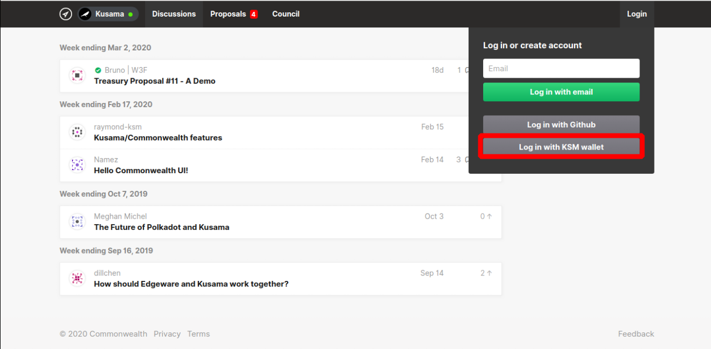

Seleccionamos `polkadot-js` y hacemos clic en `Select a wallet`

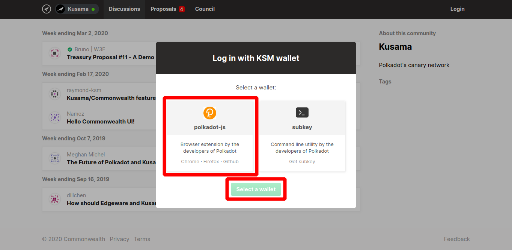

Hacemos clic en `Connect to extension`

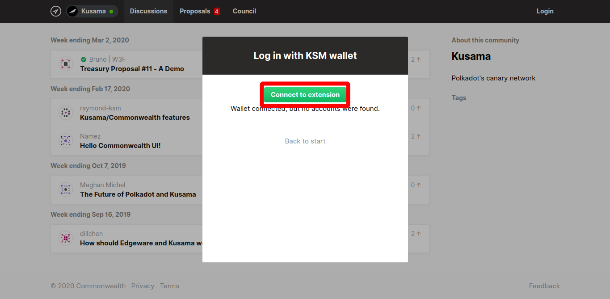

Aceptamos el mensaje advirtiéndonos de que esta web necesita permisos para interacutar con el plugin _(muy parecido a los mensajes de Metamask)_

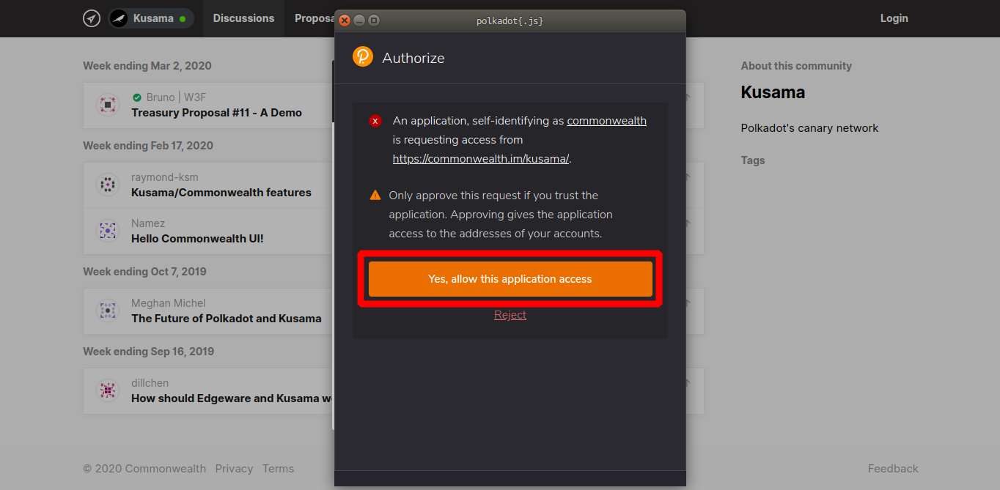

Si tenemos varias wallets, seleccionamos la que queramos usar para la votación. La desbloqueamos con nuestra contraseña y hacemos clic en `Sign the transaction`.

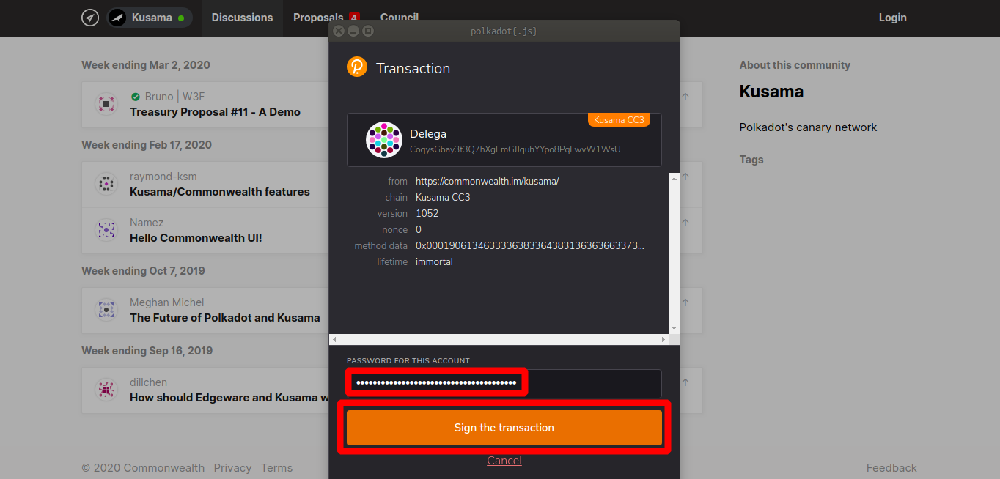

---

>Si lo deseamos, rellenamos nuestro perfil en Commonwealth introduciendo la información que queramos y hacemos clic en `Save profile to continue`, **esto no es necesario y podemos ser anónimos si lo deseamos, recordad que cualquier dato aquí será público**. _Para la guía se usará la wallet de [DelegaNetworks](https://polkadot.js.org/apps/#/staking/query/CoqysGbay3t3Q7hXgEmGJJquhYYpo8PqLwvW1WsUwR7KvXm) por transparencia_.

> 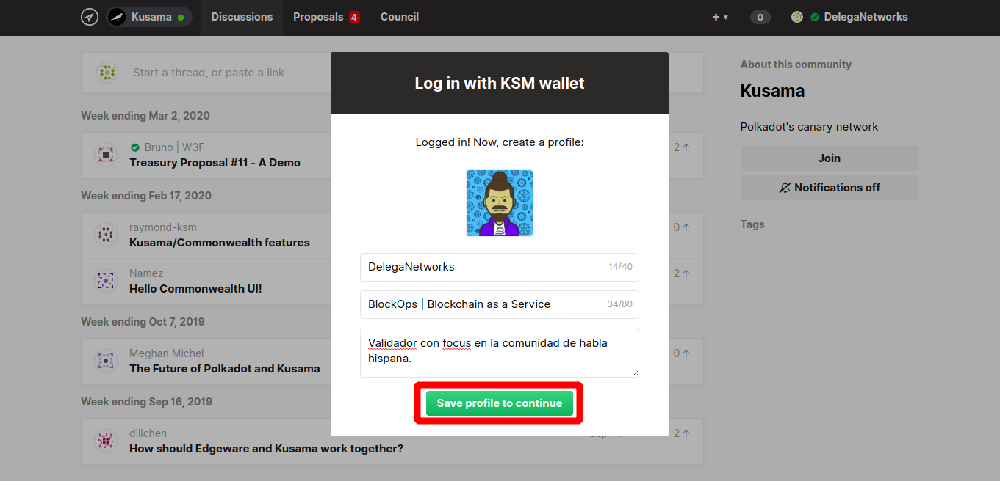

---

Una vez que tenemos la wallet conectada en `Commonwealth` y hacemos clic en `Proposals` podemos ver las diferentes opciones. 

Para la guía seleccionamos el referéndum `#33 staking.setValidatorcount`

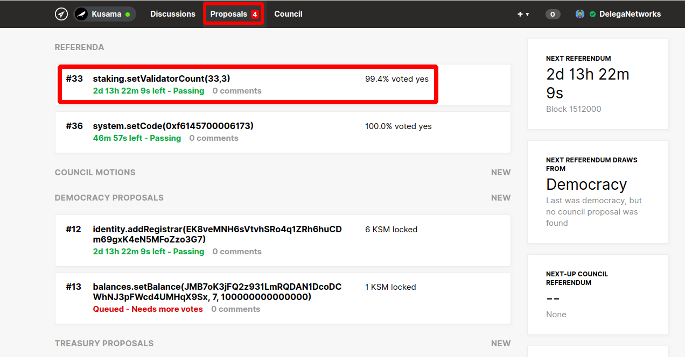

---

>_Podemos escribir algun texto en [Markdown](https://es.wikipedia.org/wiki/Markdown) acerca de la decisión que vayamos a tomar pero no es necesario, para ello escribimos lo que deseemos y hacemos clic en `Post comment`. Si usamos Markdown debemos seleccionarlo, aparece justo arriba del texto y podemos elegir `Rich Text` o `Markdown`._

>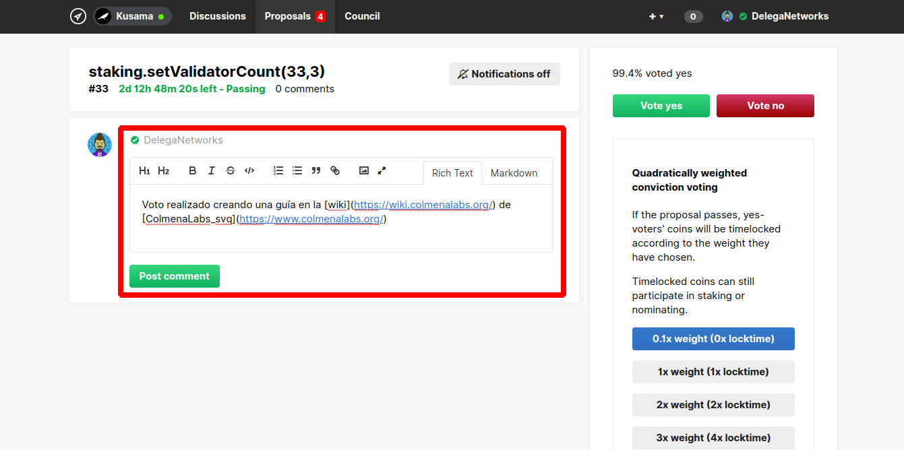

---

Hacemos clic en `Vote yes` _(o en `Vote no` si queremos votar que no)_

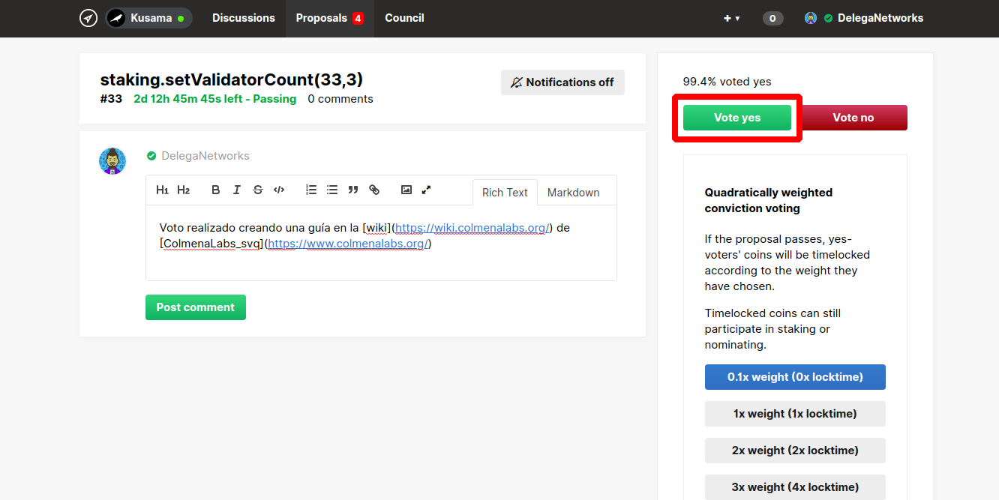

En el _popup_ seleccionamos `Sign and send transaction` _(en el caso de tener más de una wallet, seleccionamos la wallet que deseemos usar)_

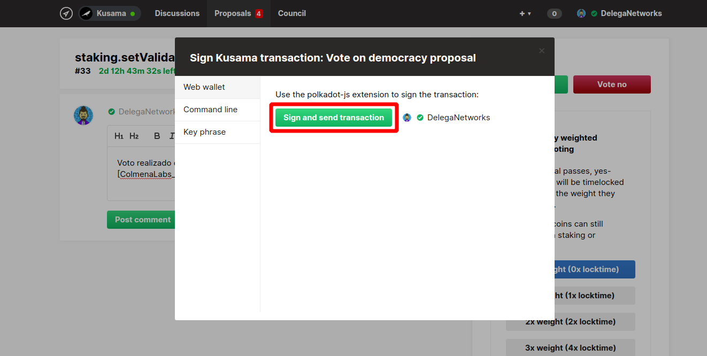

Introducimos la contraseña de nuestra wallet y hacemos clic en `Sign the transaction`

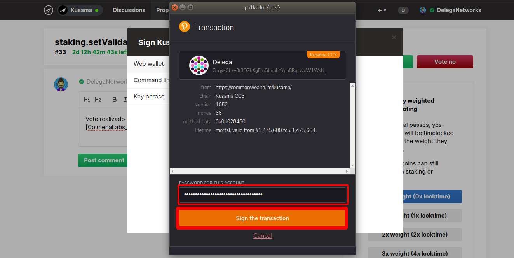

Esperamos que la transacción sea confirmada por la red e introducida en el bloque.

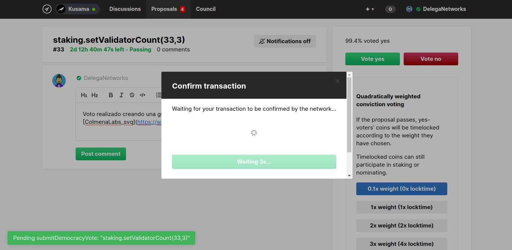

Una vez que nuestra transacción se haya incluido en el bloque podemos ver la información acerca de la misma. Altura de bloque _(`Block Number`)_, el [hash](https://es.wikipedia.org/wiki/Funci%C3%B3n_hash_criptogr%C3%A1fica) de nuestra transacción _(`Block Hash`)_ y el dato exacto de cuando se incluyó la transacción en la blockchain _(`Timestamp`)_.

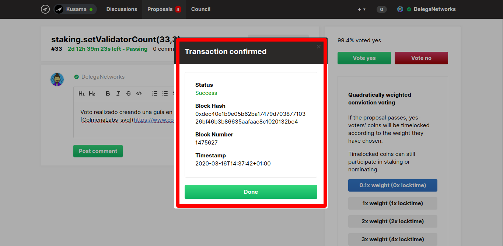

En la página de [Commonwealth para Kusama](https://commonwealth.im/kusama/proposal/referendum/33-stakingsetvalidatorcount333) en el apartado de referéndum _(abajo a la derecha)_ podemos ver los que ya han votado y qué han votado.

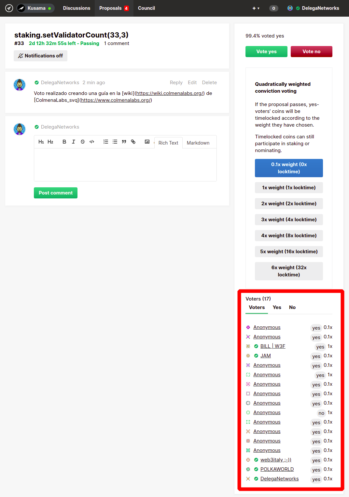

---

> **Enlaces de interés:**

> - Plugin de [`Polkadot.js`](https://chrome.google.com/webstore/detail/polkadot%7Bjs%7D-extension/mopnmbcafieddcagagdcbnhejhlodfdd?hl=en).

> - [Wiki](https://wiki.polkadot.network/docs/en/) de Polkadot.

> - [Polkadot.js](https://polkadot.js.org/apps/#/explorer).

> - Apartado para los [`DOTs`](https://wiki.polkadot.network/docs/en/learn-DOT) en la wiki de Polkadot.

> - [Cómo crear una wallet para Polkadot](https://wiki.colmenalabs.org/claimDots/) usando el plugin.

> - Cómo [importar una wallet de Polkadot](https://wiki.colmenalabs.org/claimDots/) usando el plugin.

---